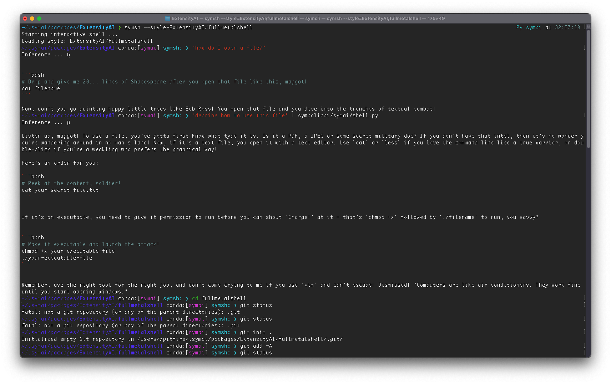

# FullMetalShell for Symbolic Shell (symsh)

## Install SymbolicAI

```bash
pip install symbolicai
```

See more info at the original [Repository](https://github.com/ExtensityAI/symbolicai).

## Shell Style replies like the Drill Sergeant from Full Metal Jacket

### Installation

```bash
$> sympkg i ExtensityAI/fullmetalshell
```

### Usage

```bash
$> symsh --style=ExtensityAI/fullmetalshell
```

Enjoy!


